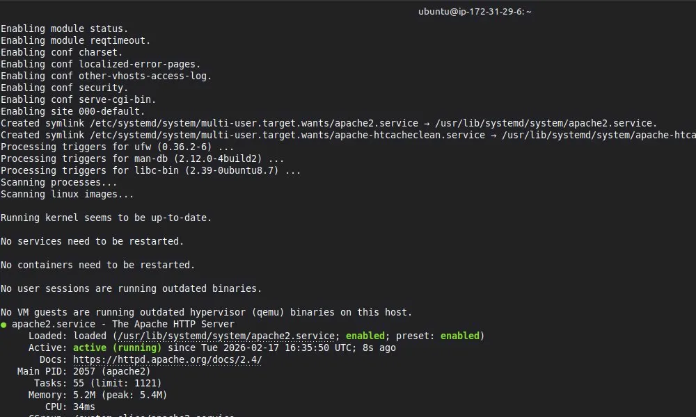

# Día 1 - Mi Primer Servidor EC2

## 📅 Fecha
Lunes, 17 de Febrero de 2026

## 🎯 Objetivo
Lanzar mi primer servidor EC2 en AWS, configurar un servidor web Apache, y acceder desde internet.

## ⏱️ Tiempo Invertido
- Día 1 (16/02): 40 minutos (setup inicial)
- Día 2 (17/02): 45 minutos (completar + documentar)
- **Total: 1.5 horas**

## 📦 Recursos Creados

### 1. Key Pair
- **Nombre:** `dia1-key`
- **Archivo:** `dia1-key.pem`
- **Permisos:** `chmod 400`
- **Uso:** Autenticación SSH para conectarse a instancias EC2

### 2. Security Group
- **ID:** `sg-0eb42302e756fba7b`
- **Nombre:** `dia1-sg`
- **Reglas:**
  - SSH (22): `0.0.0.0/0` - Acceso desde cualquier IP
  - HTTP (80): `0.0.0.0/0` - Servidor web público

### 3. EC2 Instance
- **ID:** `i-0b5c12216c5d7df54`
- **Tipo:** `t2.micro` (1 vCPU, 1GB RAM)
- **AMI:** `ami-0136735c2bb5cf5bf` (Ubuntu 24.04 LTS)
- **IP Pública (final):** `34.226.192.146`
- **Zona:** `us-east-1b`
- **Estado final:** TERMINATED ✅

## 🛠️ Stack Tecnológico

- **Cloud Provider:** AWS
- **Servicio:** EC2 (Elastic Compute Cloud)
- **OS:** Ubuntu 24.04 LTS
- **Servidor Web:** Apache 2.4
- **Herramientas:** AWS CLI, SSH, Bash

## 📝 Comandos Ejecutados

### Crear Key Pair
```bash
aws ec2 create-key-pair \
  --key-name dia1-key \
  --query 'KeyMaterial' \
  --output text > dia1-key.pem

chmod 400 dia1-key.pem
```

### Crear Security Group
```bash
aws ec2 create-security-group \
  --group-name dia1-sg \
  --description "Security group para mi primer EC2"

# Agregar reglas
aws ec2 authorize-security-group-ingress \
  --group-id sg-0eb42302e756fba7b \
  --protocol tcp --port 22 --cidr 0.0.0.0/0

aws ec2 authorize-security-group-ingress \
  --group-id sg-0eb42302e756fba7b \
  --protocol tcp --port 80 --cidr 0.0.0.0/0
```

### Lanzar Instancia
```bash
AMI_ID=$(aws ec2 describe-images \
  --owners 099720109477 \
  --filters "Name=name,Values=ubuntu/images/hvm-ssd-gp3/ubuntu-noble-24.04-amd64-server-*" \
  --query 'Images | sort_by(@, &CreationDate) | [-1].ImageId' \
  --output text)

aws ec2 run-instances \
  --image-id $AMI_ID \
  --instance-type t2.micro \
  --key-name dia1-key \
  --security-group-ids sg-0eb42302e756fba7b \
  --tag-specifications 'ResourceType=instance,Tags=[{Key=Name,Value=MiPrimerServidor}]'
```

### Conectar por SSH
```bash
ssh -i dia1-key.pem ubuntu@34.226.192.146
```

### Instalar Apache (dentro del SSH)
```bash
sudo apt update
sudo apt install -y apache2

# Crear página personalizada
sudo bash -c 'cat > /var/www/html/index.html << "EOF"
<!DOCTYPE html>
<html lang="es">
<head>
    <meta charset="UTF-8">
    <title>Mi Primer Servidor AWS</title>
</head>
<body>
    <h1>¡Mi primer servidor en AWS!</h1>
    <p><strong>Servidor:</strong> ip-172-31-29-6</p>
    <p><strong>IP Privada:</strong> 172.31.29.6</p>
    <p><strong>IP Pública:</strong> 34.226.192.146</p>
    <p><strong>Sistema:</strong> Ubuntu 24.04</p>
    <p><strong>Tecnologías:</strong> AWS EC2 + Apache</p>
    <hr>
    <p>✅ <strong>Día 1 completado</strong> 🚀</p>
</body>
</html>
EOF'
```

### Terminar Instancia
```bash
aws ec2 terminate-instances --instance-ids i-0b5c12216c5d7df54
```

## 🎓 Conceptos Aprendidos

### 1. **Key Pairs**
- Son llaves SSH para autenticación
- AWS almacena la pública, tú guardas la privada
- Sin el .pem file, NO puedes acceder a la instancia
- Permisos `400` son obligatorios para seguridad

### 2. **Security Groups**
- Actúan como firewalls virtuales
- Por defecto, TODO está bloqueado
- Son stateful (respuestas automáticas permitidas)
- Se aplican a nivel de instancia, no de subnet

### 3. **AMI (Amazon Machine Image)**
- Es la "imagen" del sistema operativo
- Contiene el OS y configuración base
- Diferentes AMIs para Ubuntu, Amazon Linux, Windows, etc.
- El AMI ID varía por región

### 4. **Instance Types**
- Definen CPU, RAM, red, almacenamiento
- `t2.micro`: 1 vCPU, 1GB RAM - perfecto para aprender
- Familias: t (burstable), m (general), c (compute), r (memory)
- Se puede cambiar el tipo después (stop → change → start)

### 5. **Estados de Instancia**
- `pending`: Iniciándose
- `running`: Operativa y cobrable
- `stopping`: Deteniéndose
- `stopped`: Detenida, NO cobrable compute (sí storage)
- `shutting-down`: Terminándose
- `terminated`: Destruida, sin costos

### 6. **IP Pública**
- Se asigna dinámicamente al lanzar
- Cambia cada vez que stop/start
- Para IP permanente: Elastic IP (costo si no está asociada)

### 7. **Diferencia Stop vs Terminate**
- **Stop:** Pausa la instancia, conserva datos, puedes reiniciar
- **Terminate:** Destruye permanentemente, NO reversible

## 💰 Análisis de Costos

### Desglose
- **Compute (t2.micro):**
  - Día 1: 20 min corriendo = $0.004
  - Día 2: 45 min corriendo = $0.009
  - **Total compute:** $0.013

- **Storage (EBS 8GB gp3):**
  - 2 días = $0.016
  
- **Data Transfer OUT:**
  - < 1MB = $0.00

### Total Día 1
**$0.029 USD** (~$0.03)

### Costo si lo hubiera dejado corriendo
- 24h/día × 30 días = $8.64/mes
- **Detener al terminar es CRÍTICO**

## 🚧 Problemas Encontrados

### 1. Encoding UTF-8
**Problema:** Caracteres extraños (á, é, ó) en el navegador

**Causa:** Falta de `<meta charset="UTF-8">` en el HTML

**Solución:** Agregar declaración de encoding en `<head>`

### 2. Sintaxis del comando echo
**Problema:** Bash interpretando `<` como redirección

**Solución:** Usar heredoc con comillas:
```bash
cat << 'EOF' | sudo tee file.html
```

## 📸 Screenshots

### Página web funcionando


### Terminal SSH conectado


## ✅ Checklist Completado

- [x] Key pair creado
- [x] Security group configurado (SSH + HTTP)
- [x] Instancia EC2 lanzada
- [x] Conexión SSH exitosa
- [x] Apache instalado
- [x] Página web personalizada
- [x] Acceso desde navegador verificado
- [x] Screenshot tomado
- [x] Instancia TERMINADA
- [x] Documentación completa 
- [x] Costos analizados

## 🔄 Próximos Pasos

- [ ] Día 2: S3 - Almacenamiento de objetos
- [ ] Día 3: VPC - Redes virtuales desde cero
- [ ] Semana 2: RDS + Load Balancer + Auto Scaling

## 💡 Reflexiones

**Lo que funcionó bien:**
- AWS CLI es poderoso y reproducible
- Security Groups son intuitivos
- t2.micro es perfecto para aprender

**Lo que mejoraría:**
- Usar User Data para automatizar instalación de Apache
- Implementar Elastic IP para IP estática
- Agregar HTTPS con Let's Encrypt

**Lección más importante:**
> "Detener (stop) NO es suficiente para $0 costo. Siempre TERMINATE cuando termines de practicar."

## 📚 Referencias

- [AWS CLI EC2 Commands](https://docs.aws.amazon.com/cli/latest/reference/ec2/)
- [Ubuntu Cloud Images](https://cloud-images.ubuntu.com/)
- [Apache Documentation](https://httpd.apache.org/docs/2.4/)

---

**Estado:** ✅ Completado  
**Fecha:** 2026-02-17  
**Tiempo total:** 1.5 horas  
**Costo total:** $0.03 USD  
**Siguiente:** S3 Basics
