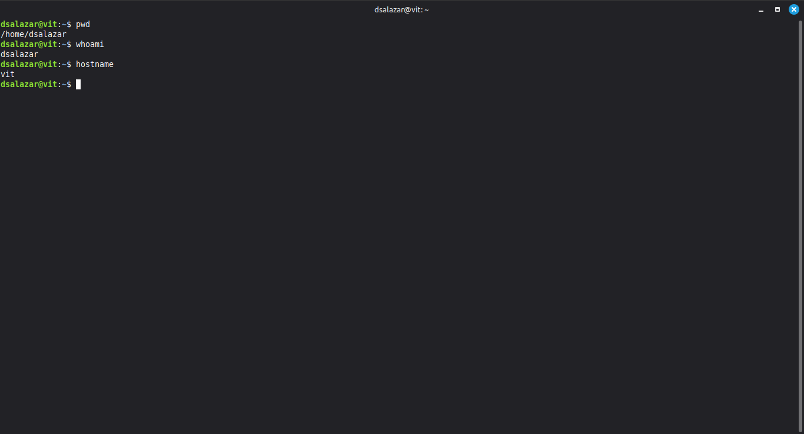
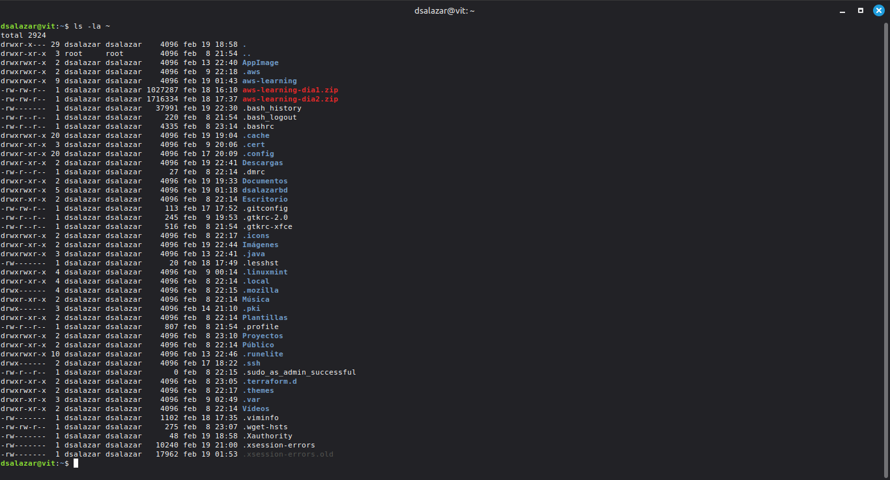
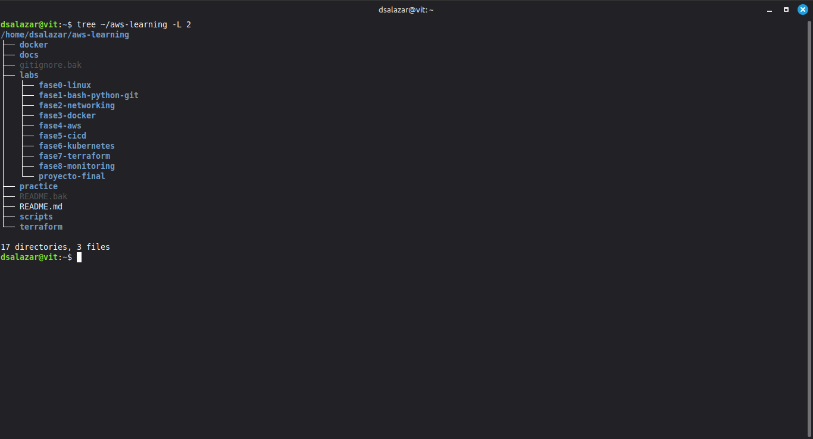
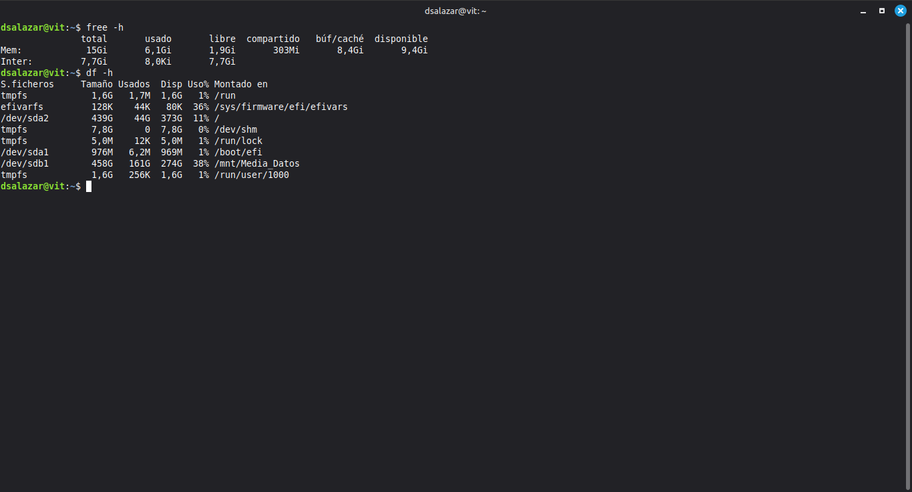
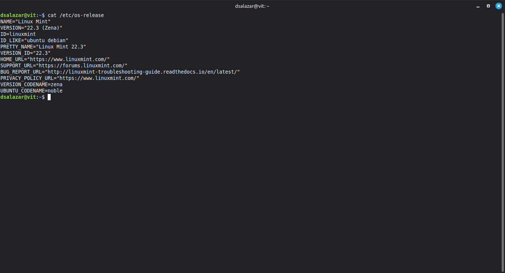

# Fase 0 · Día 1 — Sistema de Archivos y Navegación en Linux

## 📅 Fecha
Jueves, 19 de Febrero de 2026

## 🎯 Objetivo
Entender cómo está organizado Linux por dentro y navegar con confianza desde la terminal.

## ⏱️ Tiempo invertido
~2 horas

## 🖥️ Entorno
- **OS:** Linux Mint 22.3 "Zena" (basado en Ubuntu Noble)
- **RAM:** 15GB total | 9.4GB disponibles
- **Disco:** SSD 439GB (11% usado) + HDD 458GB en `/mnt/Media_Datos`
- **Usuario:** dsalazar | **Máquina:** vit

---

## 📚 Concepto clave del día

Todo en Linux parte de un único árbol que empieza en `/` (raíz). No existen letras de unidad como en Windows — todo, incluyendo discos, dispositivos y procesos, es un archivo dentro de ese árbol.

```
/
├── home/     → Carpetas personales de usuarios (/home/dsalazar)
├── etc/      → Archivos de configuración del sistema
├── var/log/  → Logs del sistema y aplicaciones
├── tmp/      → Archivos temporales (se borran al reiniciar)
├── proc/     → Info del kernel en tiempo real (virtual, no ocupa disco)
└── dev/      → Dispositivos del sistema
```

---

## 🔧 Comandos practicados

```bash
# Orientación básica
pwd                          # Muestra dónde estás
whoami                       # Usuario actual
hostname                     # Nombre de la máquina

# Listar contenido
ls                           # Lista básica
ls -l                        # Con detalles
ls -la                       # Con ocultos + detalles
ls -lh                       # Tamaños legibles (KB, MB)

# Navegar
cd /etc                      # Ir a una ruta absoluta
cd ~                         # Volver al home
cd ..                        # Subir un nivel
cd -                         # Directorio anterior

# Vista de árbol
sudo apt install tree -y
tree ~/aws-learning -L 2     # Ver estructura del repo

# Información del sistema
cat /etc/os-release          # Versión del OS
free -h                      # RAM disponible
df -h                        # Espacio en disco
nproc                        # Núcleos del CPU
uptime                       # Tiempo encendido

# Buscar
find ~/aws-learning -name "*.md"
which python3
which git
history | tail -20
```

---

## 📸 Screenshots

### 1. Orientación — pwd, whoami, hostname


### 2. Home directory — ls -la


### 3. Estructura del repo — tree


### 4. Recursos del sistema — free -h y df -h


### 5. Sistema operativo — cat /etc/os-release


---

## 🎓 Conceptos aprendidos

| Directorio | Propósito |
|-----------|-----------|
| `/` | Raíz — todo el sistema parte aquí |
| `/home` | Carpetas personales de usuarios |
| `/etc` | Configuraciones del sistema |
| `/var/log` | Logs del sistema y aplicaciones |
| `/tmp` | Archivos temporales |
| `/proc` | Info del kernel (virtual, no ocupa disco) |

**Ruta absoluta:** empieza con `/` — funciona desde cualquier lugar del sistema
**Ruta relativa:** depende de dónde estás parado — más ágil en terminal

**Leyendo `ls -la`:**
```
drwxr-xr-x 2 dsalazar dsalazar 4096 feb 19 aws-learning
│              └──┬──┘
│                 └── Dueño del archivo/directorio
└── d=directorio | -=archivo | l=enlace simbólico
```

---

## ✅ Checklist
- [x] Árbol de directorios Linux explorado (`/etc`, `/var/log`, `/home`)
- [x] Navegación con `cd` usando rutas absolutas y relativas
- [x] `ls -la` ejecutado y salida comprendida
- [x] `tree` instalado y ejecutado sobre `~/aws-learning`
- [x] Carpeta `dia01/` creada dentro de `labs/fase0-linux/`
- [x] Info del sistema revisada (`free -h`, `df -h`, `cat /etc/os-release`)
- [x] `find` y `which` practicados
- [x] Screenshots tomados y organizados

## 💡 Lección del día
> "En Linux todo es un archivo. Cuando domines la navegación, entenderás Docker, SSH, configuraciones de AWS y logs de aplicaciones — todo usa esta misma lógica."

---
**Estado:** ✅ Completado | **Tiempo:** ~2h | **Siguiente:** Día 2 — Crear, mover, copiar y eliminar archivos
