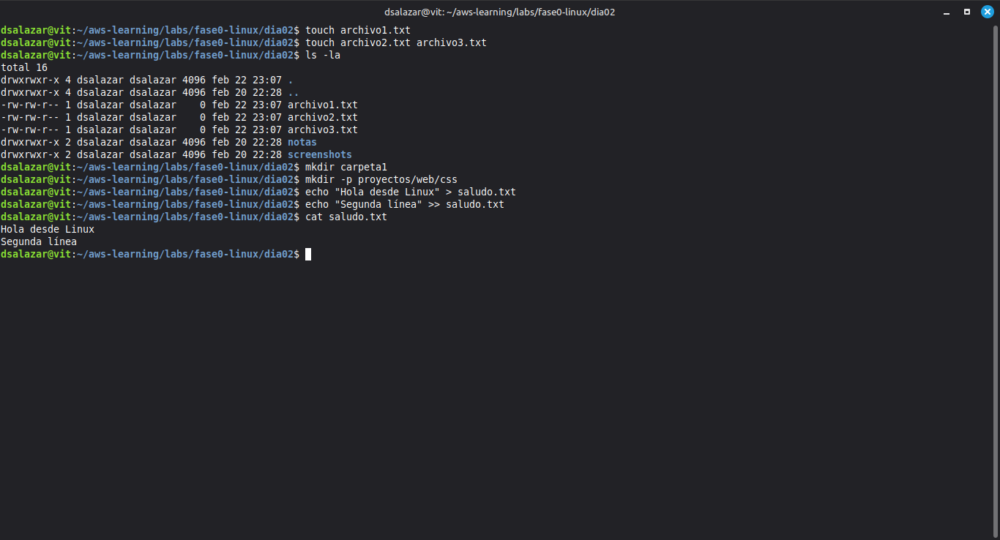
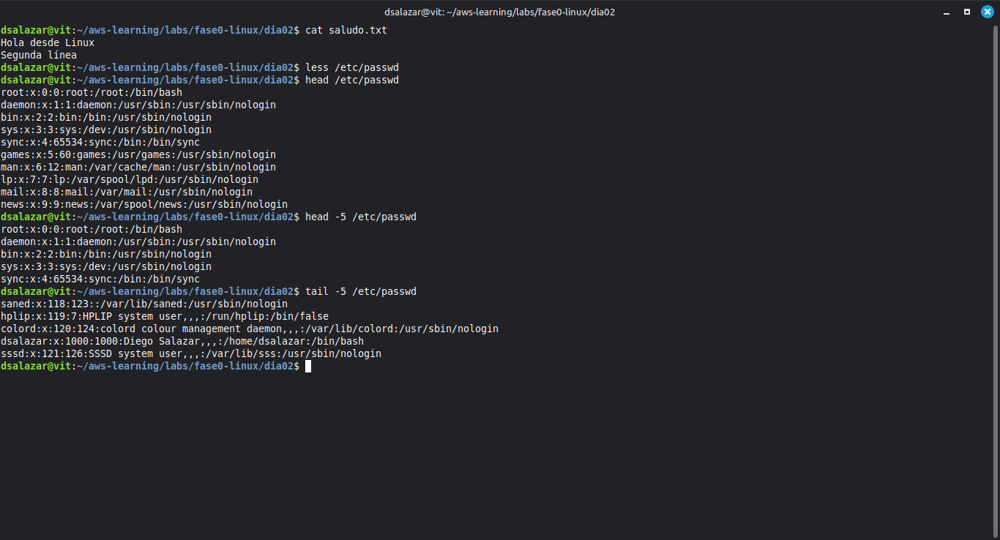
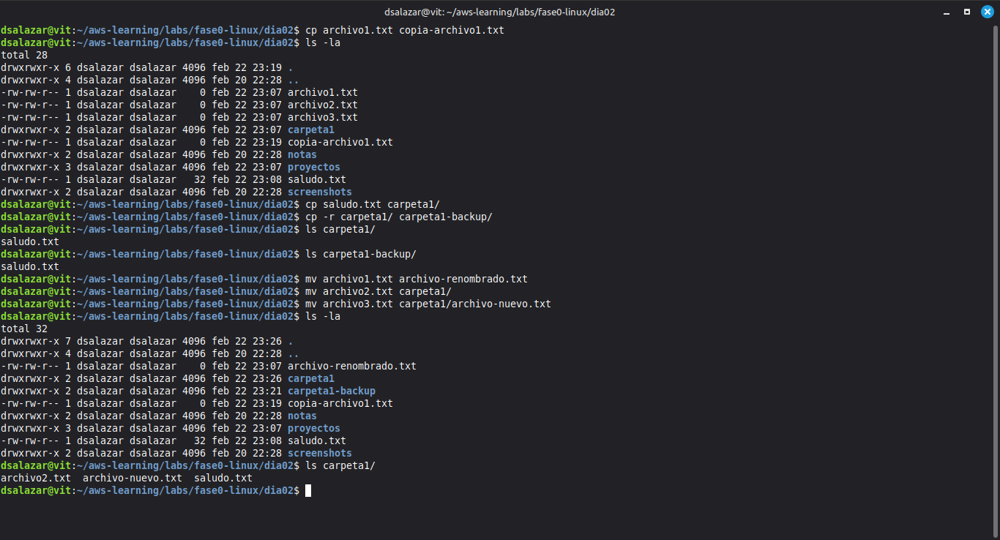
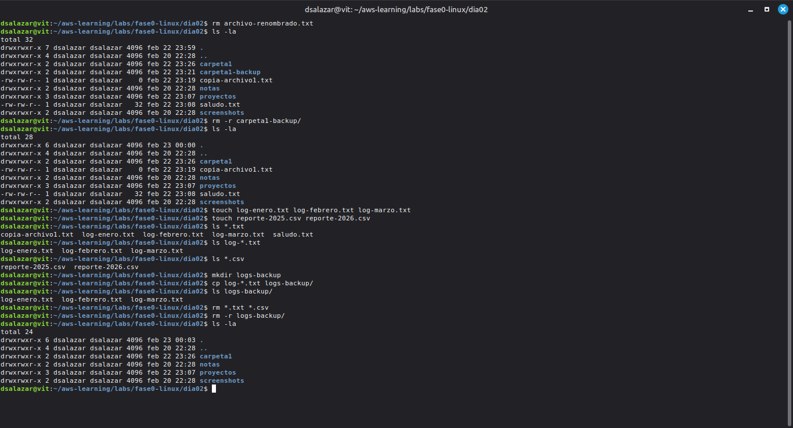
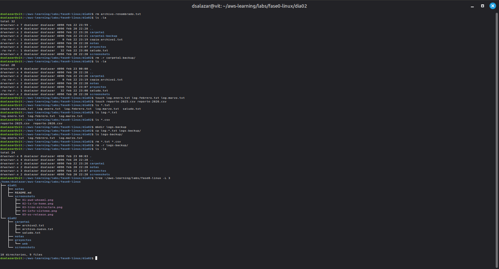

# Fase 0 · Día 2 — Gestión de Archivos y Directorios

## 📅 Fecha
Domingo, 22 de Febrero de 2026

## 🎯 Objetivo
Crear, copiar, mover, renombrar y eliminar archivos y directorios desde la terminal.

## ⏱️ Tiempo invertido
~2 horas

## 🖥️ Entorno
- **OS:** Linux Mint 22.3 "Zena" | **Usuario:** dsalazar | **Máquina:** vit

---

## 📚 Concepto clave del día

Las mismas operaciones de archivos que ejecutas hoy en tu máquina local son exactamente las que usarás en un servidor EC2, dentro de un contenedor Docker o en cualquier nodo de Kubernetes. La terminal es siempre la misma.

---

## 🔧 Comandos practicados

```bash
# Crear
touch archivo.txt                    # archivo vacío
touch arch1.txt arch2.txt            # varios a la vez
mkdir carpeta1                       # directorio
mkdir -p proyectos/web/css           # directorios anidados de una vez
echo "texto" > archivo.txt           # crear con contenido (sobreescribe)
echo "más texto" >> archivo.txt      # agregar al final (no destruye)

# Ver contenido
cat archivo.txt                      # muestra todo
less /etc/passwd                     # con navegación (q para salir)
head /etc/passwd                     # primeras 10 líneas
head -5 /etc/passwd                  # primeras 5 líneas
tail -5 /etc/passwd                  # últimas 5 líneas
tail -f /var/log/syslog              # seguimiento en tiempo real (Ctrl+C)

# Copiar
cp archivo.txt copia.txt             # mismo directorio
cp archivo.txt carpeta1/             # a otro directorio
cp -r carpeta1/ carpeta1-backup/     # directorio completo

# Mover y renombrar
mv archivo.txt nuevo-nombre.txt      # renombrar
mv archivo.txt carpeta1/             # mover
mv archivo.txt carpeta1/nuevo.txt    # mover y renombrar a la vez
mv -i origen destino                 # pedir confirmación

# Eliminar
rm archivo.txt                       # archivo
rm -r directorio/                    # directorio con contenido
rmdir directorio-vacio/              # solo si está vacío

# Wildcards
ls *.txt                             # todos los .txt
ls log-*.txt                         # los que empiezan con log-
cp log-*.txt backup/                 # copiar por patrón
rm *.txt *.csv                       # eliminar por patrón
```

---

## 📸 Screenshots

### 1. Crear archivos y directorios — touch, mkdir, echo


### 2. Ver contenido — cat, less, head, tail


### 3. Copiar y mover — cp, mv


### 4. Eliminar y wildcards — rm, wildcards


### 5. Estructura final del día — tree


---

## 🎓 Conceptos aprendidos

| Comando | Qué hace |
|---------|----------|
| `touch` | Crea archivo vacío |
| `mkdir -p` | Crea directorios anidados de una vez |
| `>` | Escribe en archivo — **sobreescribe sin preguntar** |
| `>>` | Agrega al final — no destruye contenido existente |
| `cat` | Muestra archivo completo |
| `less` | Navegación en archivos largos |
| `head / tail` | Primeras o últimas líneas |
| `tail -f` | Seguimiento en tiempo real — clave para logs en producción |
| `cp -r` | Copia directorios completos |
| `mv` | Mueve Y renombra con el mismo comando |
| `rm -r` | Elimina directorio sin papelera, sin confirmación |
| `*` y `?` | Wildcards para seleccionar múltiples archivos por patrón |

**Diferencia crítica aprendida hoy:**
- `>` sobreescribe sin preguntar
- `rm` borra sin papelera
- En un servidor de producción, estos dos mal usados pueden costar horas de recuperación

---

## ✅ Checklist
- [x] Archivos creados con `touch` y `mkdir -p`
- [x] Diferencia `>` vs `>>` comprendida y probada
- [x] `cat`, `less`, `head`, `tail` ejecutados sobre `/etc/passwd`
- [x] `tail -f` ejecutado sobre `/var/log/syslog`
- [x] Archivos copiados con `cp` y directorios con `cp -r`
- [x] Archivos movidos y renombrados con `mv`
- [x] Archivos eliminados con `rm` y `rm -r`
- [x] Wildcards `*` practicados con `ls`, `cp` y `rm`
- [x] Screenshots tomados y organizados
- [x] Push a GitHub hecho

## 💡 Lección del día
> "`>` sobreescribe sin preguntar y `rm` borra sin papelera. El hábito de verificar antes de ejecutar se construye hoy — en producción no hay Ctrl+Z."

---
**Estado:** ✅ Completado | **Tiempo:** ~2h | **Siguiente:** Día 3 — Usuarios, grupos y permisos
