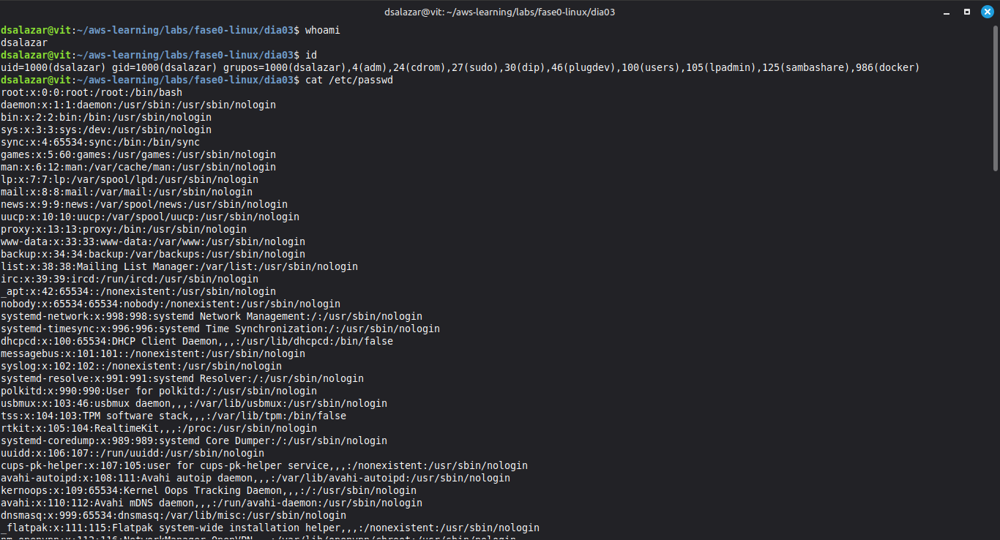
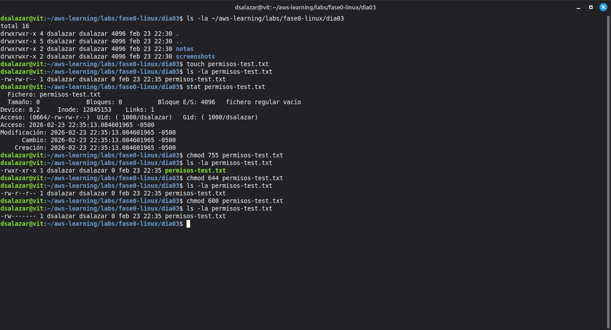
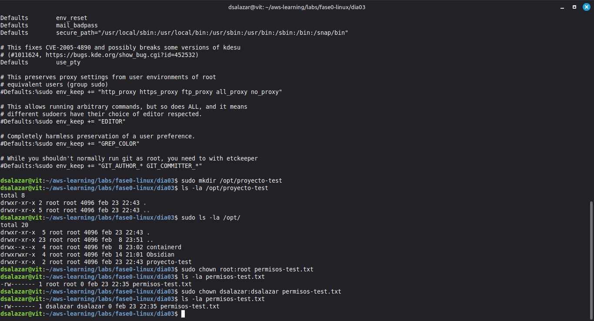
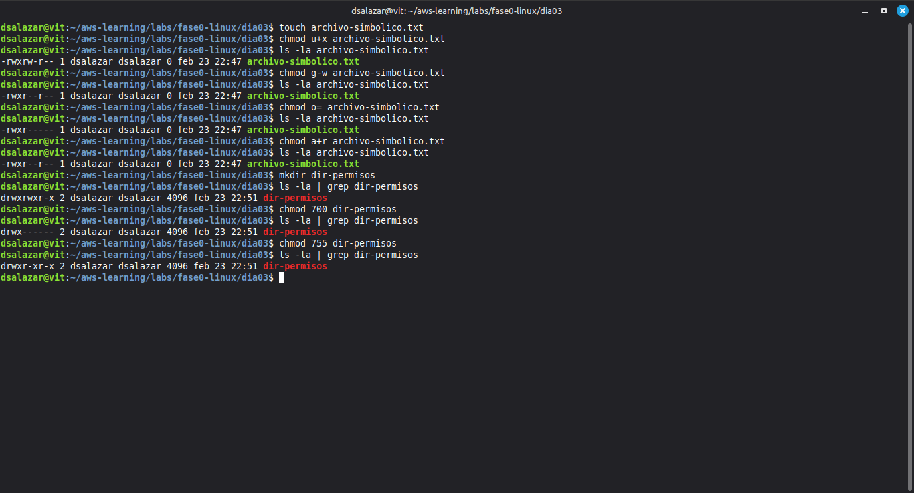
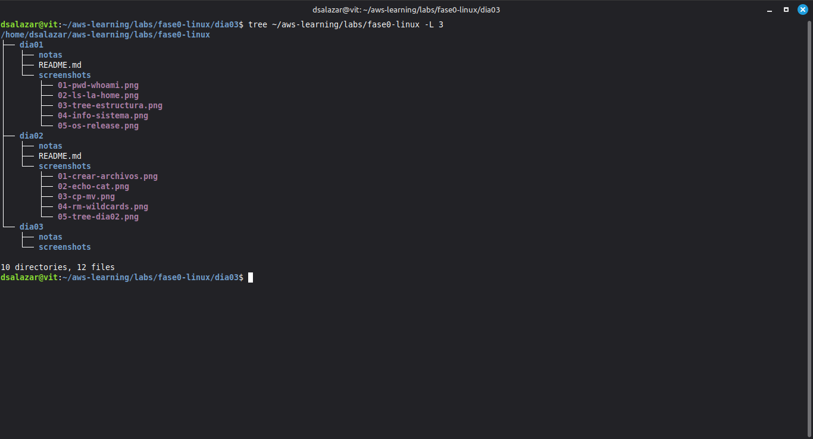

# Fase 0 · Día 3 — Usuarios, Grupos y Permisos

## 📅 Fecha
Lunes, 23 de Febrero de 2026

## 🎯 Objetivo
Comprender y gestionar usuarios, grupos y permisos en Linux — la base de toda la seguridad en sistemas Unix y el concepto detrás de AWS IAM.

## ⏱️ Tiempo invertido
~3.5 horas

## 🖥️ Entorno
- **OS:** Linux Mint 22.3 "Zena" | **Usuario:** dsalazar | **Máquina:** vit

---

## 📚 Concepto clave del día

Todo en Linux tiene un propietario y un conjunto de permisos. Cada archivo, directorio, proceso y servicio pertenece a un usuario y a un grupo. Este modelo es exactamente el mismo que AWS implementa con IAM: identidades, grupos y permisos granulares. Entenderlo aquí es entenderlo allá.

---

## 🔧 Comandos practicados

```bash
# Información de usuario
whoami                              # usuario actual
id                                  # uid, gid y todos los grupos
groups                              # grupos del usuario actual
groups dsalazar                     # grupos de un usuario específico

# Archivos del sistema
cat /etc/passwd                     # todos los usuarios del sistema
awk -F: '$3 >= 1000 {print $1, $3, $6}' /etc/passwd   # solo usuarios reales
cat /etc/group                      # todos los grupos
cat /etc/shadow                     # hashes de contraseñas (requiere sudo)

# Ver permisos
ls -la archivo.txt                  # permisos detallados
stat archivo.txt                    # información completa incluyendo permisos en octal

# chmod numérico
chmod 755 archivo.txt               # rwxr-xr-x
chmod 644 archivo.txt               # rw-r--r--
chmod 600 archivo.txt               # rw------- (solo propietario)
chmod 700 directorio/               # drwx------ (solo propietario puede entrar)

# chmod simbólico
chmod u+x archivo.txt               # agregar ejecución al usuario
chmod g-w archivo.txt               # quitar escritura al grupo
chmod o= archivo.txt                # quitar todo a otros
chmod a+r archivo.txt               # agregar lectura a todos

# chown — cambiar propietario
sudo chown root:root archivo.txt    # cambiar a root
sudo chown dsalazar:dsalazar archivo.txt  # devolver al usuario

# sudo
sudo ls /root                       # ejecutar como root
sudo mkdir /opt/proyecto-test       # crear en directorio del sistema
sudo cat /etc/sudoers | head -30    # ver configuración de sudo
```

---

## 📸 Screenshots

### 1. Usuarios y grupos del sistema


### 2. chmod numérico


### 3. chown y sudo


### 4. chmod simbólico y permisos en directorios


### 5. Estructura final del día — tree


---

## 🎓 Conceptos aprendidos

| Concepto | Descripción |
|----------|-------------|
| `uid / gid` | Identificador numérico de usuario y grupo |
| `UID >= 1000` | Usuarios reales del sistema (los del sistema son < 1000) |
| Grupos del usuario | `sudo`, `docker`, `adm` — cada uno otorga privilegios específicos |
| `/etc/passwd` | Base de datos de usuarios del sistema |
| `/etc/shadow` | Contraseñas hasheadas — solo root puede leerlo |
| `chmod numérico` | 7=rwx, 6=rw-, 5=r-x, 4=r--, 0=--- |
| `chmod simbólico` | u/g/o/a + +/-/= + r/w/x |
| `chown` | Cambiar propietario y grupo de un archivo |
| `sudo` | Ejecutar como root — requiere estar en el grupo sudo |
| Permisos en dirs | `x` en directorio = permiso para entrar con `cd` |

**Tabla de permisos más usados:**

| Octal | Simbólico | Uso típico |
|-------|-----------|------------|
| 600 | rw------- | Llaves SSH privadas |
| 644 | rw-r--r-- | Archivos de configuración |
| 700 | rwx------ | Directorios privados |
| 755 | rwxr-xr-x | Scripts ejecutables, directorios públicos |
| 777 | rwxrwxrwx | Nunca en producción |

**Dato del sistema propio:**
```
uid=1000(dsalazar) grupos: adm, sudo, docker
```
- `sudo` → permisos de administrador
- `docker` → acceso a Docker sin sudo — listo para la Fase 2

---

## ✅ Checklist
- [x] `id` y `groups` ejecutados e interpretados
- [x] `/etc/passwd` y `/etc/group` explorados
- [x] `stat` usado para ver permisos en octal
- [x] `chmod` numérico practicado (755, 644, 600)
- [x] `chmod` simbólico practicado (u+x, g-w, o=, a+r)
- [x] Diferencia de permisos en archivos vs directorios comprendida
- [x] `chown` usado para cambiar y restaurar propietario
- [x] `sudo` ejecutado sobre archivos del sistema
- [x] Screenshots tomados y organizados
- [x] Push a GitHub hecho

## 💡 Lección del día
> "En Linux todo tiene un dueño y un permiso. En AWS todo tiene un rol y una política. Son el mismo concepto — quien no entiende `chmod` no entiende IAM."

---
**Estado:** ✅ Completado | **Tiempo:** ~3.5h | **Siguiente:** Día 4 — Procesos y servicios
