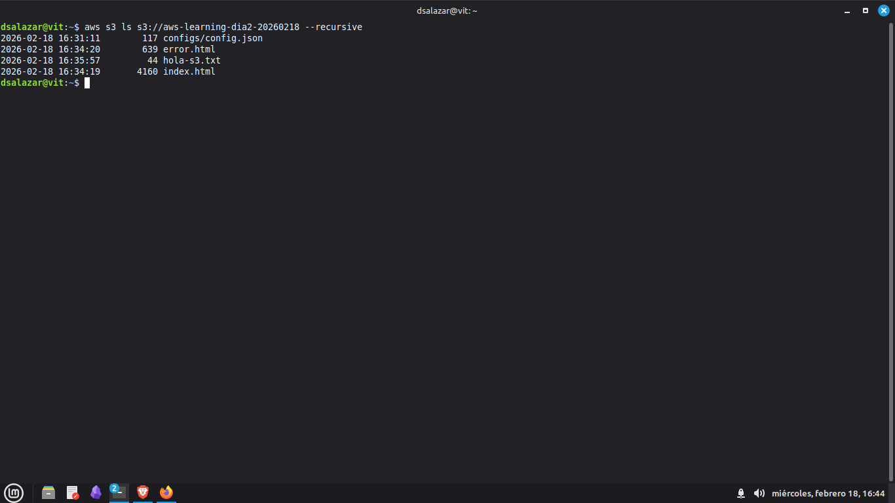

# Día 2 - S3: Static Website Hosting

## 📅 Fecha
Miércoles, 18 de Febrero de 2026

## 🎯 Objetivo
Dominar S3: crear buckets, gestionar objetos, alojar un sitio web estático y habilitar versioning — todo desde AWS CLI.

## ⏱️ Tiempo Real Invertido
- **Tiempo real:** ~9 horas
- Motivo: Día de reposo médico aprovechado para práctica intensiva

## 📦 Recursos Creados

| Recurso | Detalle |
|---------|---------|
| Bucket | `aws-learning-dia2-20260218` · us-east-1 |
| Objetos | config.json, error.html, hola-s3.txt, index.html |
| Website | Static hosting habilitado |
| Versioning | Habilitado y verificado |
| Estado final | ELIMINADO ✅ |

## 🔧 Comandos Clave

```bash
# Crear bucket
BUCKET_NAME="aws-learning-dia2-$(date +%Y%m%d)"
aws s3api create-bucket --bucket $BUCKET_NAME --region us-east-1

# Subir archivos
aws s3 cp index.html s3://$BUCKET_NAME/ --content-type "text/html"
aws s3 cp error.html s3://$BUCKET_NAME/ --content-type "text/html"
aws s3 ls s3://$BUCKET_NAME/ --recursive

# Habilitar website hosting
aws s3api put-public-access-block --bucket $BUCKET_NAME \
  --public-access-block-configuration \
  "BlockPublicAcls=false,IgnorePublicAcls=false,BlockPublicPolicy=false,RestrictPublicBuckets=false"

aws s3api put-bucket-website --bucket $BUCKET_NAME \
  --website-configuration \
  '{"IndexDocument":{"Suffix":"index.html"},"ErrorDocument":{"Key":"error.html"}}'

aws s3api put-bucket-policy --bucket $BUCKET_NAME --policy file://bucket-policy.json

# Versioning
aws s3api put-bucket-versioning --bucket $BUCKET_NAME \
  --versioning-configuration Status=Enabled

# CORRECTO: list-object-versions requiere --bucket explícito
aws s3api list-object-versions --bucket $BUCKET_NAME

# Limpieza
aws s3 rm s3://$BUCKET_NAME/ --recursive
aws s3api delete-bucket --bucket $BUCKET_NAME --region us-east-1
```

## 📸 Screenshots

### Bucket visible en aws s3 ls


### Objetos subidos


### Sitio web funcionando desde S3


### Versioning activo


## 🎓 Conceptos Aprendidos

- **Bucket:** Contenedor único global — nombre inmutable tras creación
- **Static Website Hosting:** Serve HTML/CSS/JS sin ningún servidor
- **Bucket Policy:** JSON de control de acceso (recomendado sobre ACLs)
- **Versioning:** Historial completo — protección contra borrado accidental

### EC2 vs S3 para Web
| | EC2 (Día 1) | S3 (Día 2) |
|--|-------------|------------|
| Gestión de servidor | Requerida | Ninguna |
| Costo | Por hora encendido | Por GB almacenado |
| Escala | Manual | Automática |
| Uso ideal | Apps dinámicas | Contenido estático |

## 💰 Análisis de Costos (Real)

| Recurso | Costo |
|---------|-------|
| Storage ~5KB durante práctica | ~$0.001 |
| PUT/GET requests | ~$0.0001 |
| **Total Día 2** | **~$0.001 USD** |

> 📌 Nota: La consola de AWS aún no refleja el costo final de S3. Se actualizará en próximas horas.

**Journey total confirmado por consola: $0.07 USD** ✅

## 🚧 Fix Aplicado
`list-object-versions` requiere `--bucket NOMBRE` explícito — corregido durante la práctica.

## ✅ Checklist
- [x] Bucket creado con nombre único
- [x] Objetos subidos/descargados
- [x] Static website funcionando (URL pública)
- [x] Bucket policy configurada
- [x] Versioning habilitado y verificado
- [x] Bucket ELIMINADO (costo $0 ongoing)
- [x] Documentación completa

## 💡 Lección clave
> "S3 no es solo almacenamiento — es la base de arquitecturas serverless completas."

---
**Estado:** ✅ Completado | **Tiempo real:** ~9h | **Costo:** ~$0.001 USD | **Siguiente:** VPC
